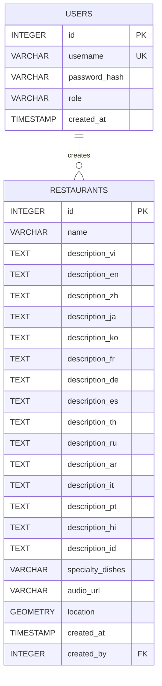
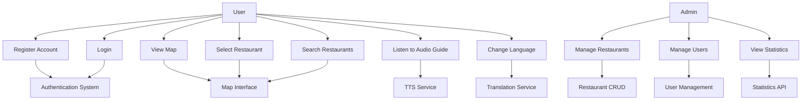
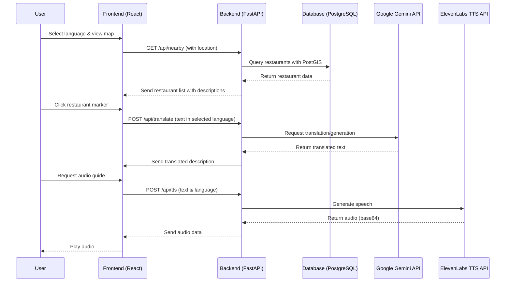
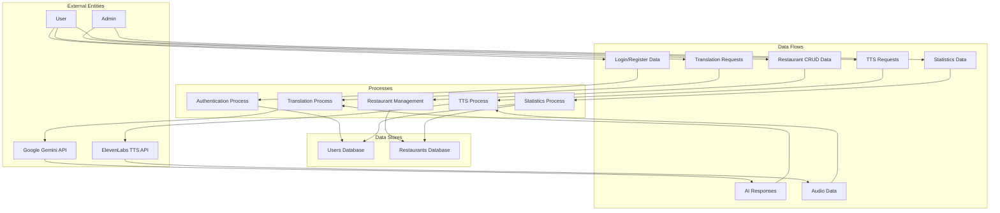

# Báo Cáo Đồ Án: Map-Hoi-An - Hệ Thống Hướng Dẫn Bằng Giọng Nói AI Cho Nhà Hàng Hội An

**Tác giả:** [Tên của bạn]  
**Ngày:** 17/04/2026  
**Trường:** Đại học Công nghệ Thông tin (ĐHQG-HCM)  
**Môn học:** Seminar E502  
**Giảng viên hướng dẫn:** [Tên giảng viên]

---

## Mục Lục
1. [Giới Thiệu](#giới-thiệu)
2. [Phân Tích Dự Án](#phân-tích-dự-án)
   - [Mục Đích và Tính Năng Chính](#mục-đích-và-tính-năng-chính)
   - [Công Nghệ Sử Dụng](#công-nghệ-sử-dụng)
   - [Cấu Trúc Dự Án](#cấu-trúc-dự-án)
3. [Thiết Kế Hệ Thống](#thiết-kế-hệ-thống)
   - [Sơ Đồ Kiến Trúc Hệ Thống](#sơ-đồ-kiến-trúc-hệ-thống)
   - [Sơ Đồ Cơ Sở Dữ Liệu](#sơ-đồ-cơ-sở-dữ-liệu)
   - [Sơ Đồ Use Case](#sơ-đồ-use-case)
   - [Sơ Đồ Tuần Tự](#sơ-đồ-tuần-tự)
   - [Sơ Đồ Luồng Dữ Liệu](#sơ-đồ-luồng-dữ-liệu)
4. [Triển Khai và Chạy Dự Án](#triển-khai-và-chạy-dự-án)
5. [Kết Luận](#kết-luận)
6. [Tài Liệu Tham Khảo](#tài-liệu-tham-khảo)

---

## Giới Thiệu

Dự án **Map-Hoi-An** (còn gọi là **Vinh Khanh Food Street Voice System**) là một ứng dụng web thông minh được phát triển để cung cấp trải nghiệm du lịch tương tác tại Hội An, Việt Nam. Hệ thống sử dụng trí tuệ nhân tạo (AI) để tạo ra các hướng dẫn bằng giọng nói đa ngôn ngữ, giúp du khách khám phá các nhà hàng địa phương một cách thuận tiện và hấp dẫn.

Dự án này được xây dựng như một phần của đồ án Seminar E502, tập trung vào việc tích hợp các công nghệ web hiện đại với các dịch vụ AI thương mại để giải quyết vấn đề thực tế trong lĩnh vực du lịch.

---

## Phân Tích Dự Án

### Mục Đích và Tính Năng Chính
- **Bản đồ tương tác**: Hiển thị vị trí các nhà hàng với khả năng zoom, pan và theo dõi GPS thời gian thực.
- **Hướng dẫn bằng giọng nói**: Sử dụng AI để tạo và dịch mô tả nhà hàng, sau đó chuyển đổi thành âm thanh tự nhiên.
- **Hỗ trợ đa ngôn ngữ**: 15 ngôn ngữ bao gồm tiếng Việt, Anh, Trung, Nhật, Hàn, Pháp, Đức, Tây Ban Nha, Thái, Nga, Ả Rập, Ý, Bồ Đào Nha, Hindi và Indonesia.
- **Xác thực người dùng**: Hệ thống đăng nhập/đăng ký với phân quyền dựa trên vai trò (user và admin).
- **Quản lý admin**: Bảng điều khiển để quản lý nhà hàng, người dùng và xem thống kê hệ thống.

### Công Nghệ Sử Dụng
- **Backend**: FastAPI (Python), PostgreSQL với PostGIS, tích hợp Google Gemini API (tạo văn bản/dịch) và ElevenLabs API (text-to-speech).
- **Frontend**: React 19 với Vite, Tailwind CSS, Leaflet cho bản đồ, Axios cho HTTP requests.
- **AI Strategy**: Hybrid approach với Large Language Models (LLM) cho văn bản và Neural TTS cho giọng nói, sử dụng Retrieval-Augmented Generation (RAG) để đảm bảo độ chính xác.

### Cấu Trúc Dự Án
```
📦 Map-Hoi-An
├── 📄 README.md                     # Tài liệu dự án
├── 📄 web-app_structure.txt         # Cấu trúc frontend
├── 📄 AI_REVIEW.txt                 # Hướng dẫn triển khai AI
├── 📁 back_end/
│   ├── main.py                      # Server FastAPI
│   └── requirements.txt              # Dependencies Python
└── 📁 front_end/front_end/
    ├── package.json                 # Dependencies React
    ├── src/
    │   ├── App.jsx                  # Component chính
    │   └── main.jsx                 # Entry point
    └── public/                      # Assets tĩnh
```

---

## Thiết Kế Hệ Thống

### Sơ Đồ Kiến Trúc Hệ Thống
```mermaid
graph TB
    subgraph "Frontend (React + Vite)"
        A[User Interface]
        B[Map Component (Leaflet)]
        C[Audio Player]
        D[Language Selector]
        E[Admin Dashboard]
    end
    
    subgraph "Backend (FastAPI)"
        F[Authentication API]
        G[Restaurant CRUD API]
        H[AI Translation API]
        I[TTS API]
        J[Statistics API]
    end
    
    subgraph "External Services"
        K[Google Gemini API]
        L[ElevenLabs TTS API]
    end
    
    subgraph "Database (PostgreSQL + PostGIS)"
        M[Users Table]
        N[Restaurants Table]
    end
    
    A --> F
    A --> G
    A --> H
    A --> I
    A --> J
    F --> M
    G --> N
    H --> K
    I --> L
    B --> G
    C --> I
    D --> H
    E --> G
    E --> J
```

*Sơ đồ này minh họa kiến trúc tổng quan của hệ thống, bao gồm các thành phần frontend, backend, database và dịch vụ bên ngoài.*

### Sơ Đồ Cơ Sở Dữ Liệu


*Sơ đồ ER này mô tả cấu trúc cơ sở dữ liệu với hai bảng chính: USERS và RESTAURANTS, sử dụng PostGIS cho dữ liệu địa lý.*

### Sơ Đồ Use Case


*Sơ đồ use case xác định các actor và chức năng chính của hệ thống.*

### Sơ Đồ Tuần Tự


*Sơ đồ tuần tự chi tiết luồng tương tác cho chức năng lấy nhà hàng và nghe hướng dẫn.*

### Sơ Đồ Luồng Dữ Liệu


*Sơ đồ DFD hiển thị luồng dữ liệu giữa các thực thể bên ngoài, quá trình xử lý và kho dữ liệu.*

---

## Triển Khai và Chạy Dự Án

### Yêu Cầu Hệ Thống
- Python 3.8+
- Node.js 16+
- PostgreSQL với PostGIS extension
- Tài khoản API: Google Gemini và ElevenLabs

### Các Bước Triển Khai
1. **Cài đặt dependencies backend**:
   ```
   cd back_end
   pip install -r requirements.txt
   ```

2. **Thiết lập database**:
   - Tạo database PostgreSQL
   - Cài đặt PostGIS extension
   - Chạy script tạo bảng (nếu có)

3. **Cài đặt dependencies frontend**:
   ```
   cd front_end/front_end
   npm install
   ```

4. **Cấu hình environment**:
   - Tạo file `.env` với `GEMINI_API_KEY`, `ELEVENLABS_API_KEY`, `DATABASE_URL`

5. **Chạy backend**:
   ```
   cd back_end
   python main.py
   ```

6. **Chạy frontend**:
   ```
   cd front_end/front_end
   npm run dev
   ```

### Đẩy Lên GitHub
1. Khởi tạo repository Git (nếu chưa có):
   ```
   git init
   git add .
   git commit -m "Initial commit: Map-Hoi-An project with complete report"
   ```

2. Tạo repository trên GitHub và thêm remote:
   ```
   git remote add origin https://github.com/your-username/Map-Hoi-An-Report.git
   git push -u origin main
   ```

3. Đẩy file báo cáo:
   ```
   git add REPORT.md
   git commit -m "Add complete project report with diagrams"
   git push
   ```

---

## Kết Luận

Dự án Map-Hoi-An đã thành công trong việc tích hợp các công nghệ web hiện đại với AI để tạo ra một hệ thống hướng dẫn du lịch thông minh. Các sơ đồ thiết kế đã minh họa rõ ràng kiến trúc, luồng dữ liệu và tương tác trong hệ thống, đảm bảo tính mở rộng và bảo mật.

Điểm mạnh của dự án bao gồm:
- Tích hợp AI thương mại hiệu quả
- Hỗ trợ đa ngôn ngữ toàn diện
- Giao diện người dùng thân thiện
- Kiến trúc microservices với API-first approach

Trong tương lai, dự án có thể mở rộng bằng cách fine-tune các model AI riêng hoặc tích hợp thêm các dịch vụ như AR/VR cho trải nghiệm du lịch immersive hơn.

---

## Tài Liệu Tham Khảo
1. FastAPI Documentation: https://fastapi.tiangolo.com/
2. React Documentation: https://react.dev/
3. Google Gemini API: https://ai.google.dev/
4. ElevenLabs TTS: https://elevenlabs.io/
5. PostGIS Documentation: https://postgis.net/documentation/
6. Mermaid Diagrams: https://mermaid.js.org/

---

*Báo cáo này được tạo tự động từ source code của dự án Map-Hoi-An. Để chỉnh sửa hoặc thêm thông tin, vui lòng liên hệ tác giả.*