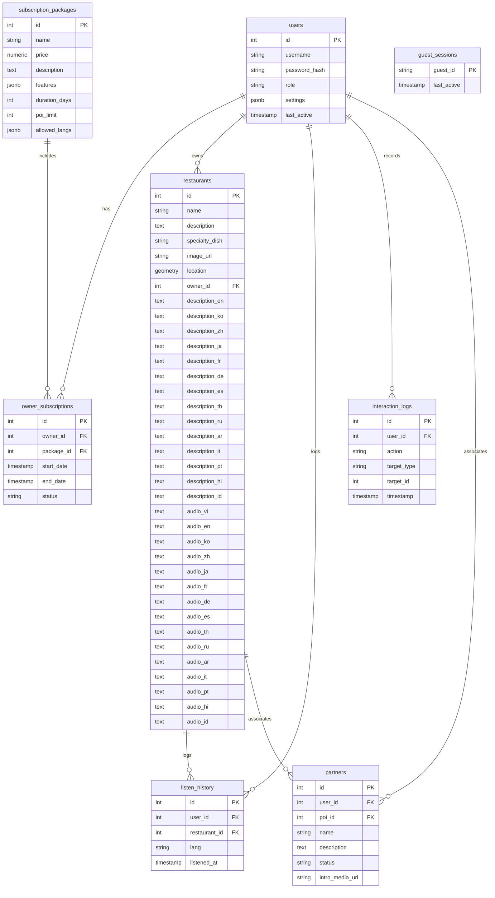
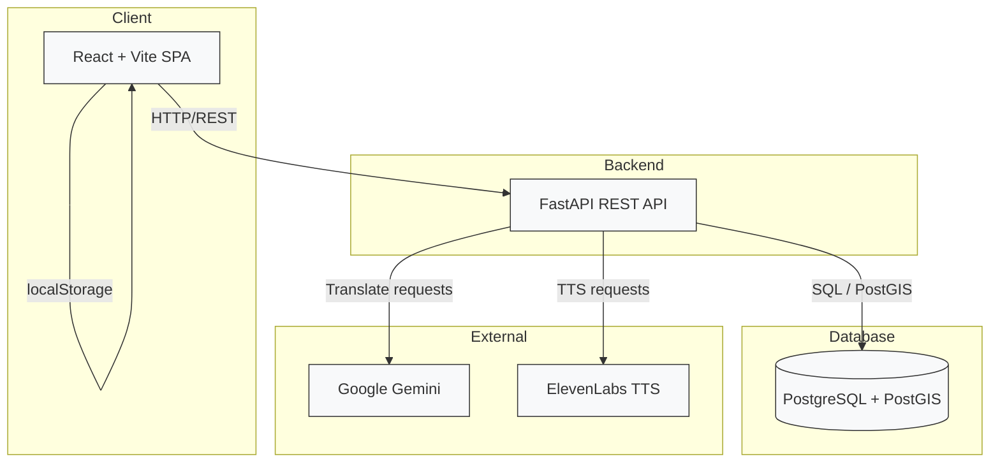
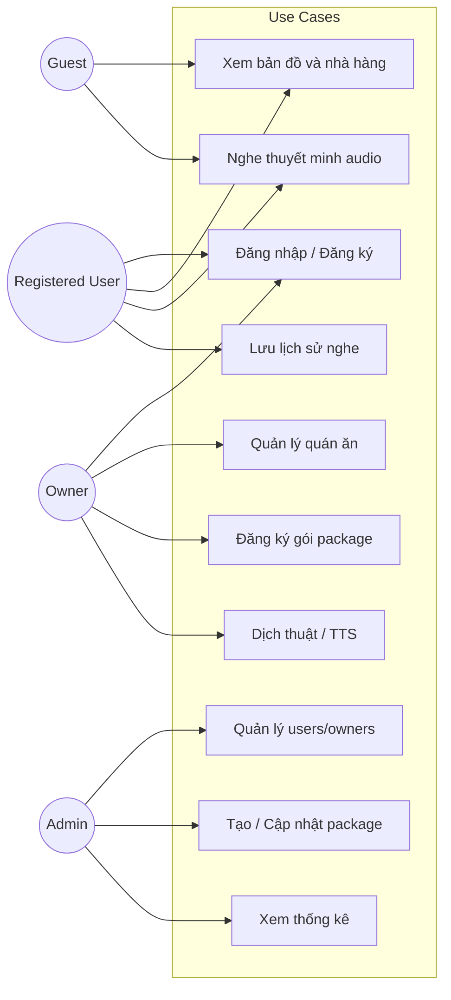

# Thiết Kế Hệ Thống - VinhKhanh Food

## 5.1 ERD

Xem chi tiết sơ đồ ERD tại [diagrams/ERD.md](diagrams/ERD.md).



> Lưu ý: bảng `partners` và `interaction_logs` được thêm vào bằng `init_pois.sql`.

## 5.2 Activity Diagram

```mermaid
flowchart TD
    Start[Người dùng mở ứng dụng] --> FetchData[Frontend gọi GET /api/nearby để lấy danh sách quán]
    FetchData --> GPS[GPS tracking bắt đầu, watchPosition]
    GPS --> Heartbeat[POST /api/users/heartbeat mỗi 5s]

    Heartbeat --> CheckAuth{Kiểm tra localStorage 'vinhkhanh_user'}
    CheckAuth -->|Không có user| GuestMode[Hiển thị MapViewer cho Guest]
    CheckAuth -->|Có user| CheckRole{Role của user}

    CheckRole -->|user| UserMode[Hiển thị MapViewer với user features]
    CheckRole -->|owner| OwnerMode[Hiển thị Dashboard Owner]
    CheckRole -->|admin| AdminMode[Hiển thị Dashboard Admin]

    GuestMode --> BrowseMap[Xem bản đồ, chọn quán]
    BrowseMap --> AutoNearby[Tự động mở popup nếu GPS gần quán <30m]
    AutoNearby --> PlayAudio[Chọn ngôn ngữ, nghe audio base64 từ restaurant.audio_<lang>]
    PlayAudio --> GuestMode

    UserMode --> BrowseMap
    UserMode --> LoginHistory[Xem lịch sử nghe GET /api/user/history/{user_id}]
    LoginHistory --> UserMode

    OwnerMode --> ManageRestaurants[GET /api/owner/my_restaurants/{owner_id}]
    ManageRestaurants --> CRUD[POST/PUT/DELETE /api/restaurants]
    CRUD --> Translate[POST /api/translate với Google Gemini]
    Translate --> TTS[POST /api/tts với ElevenLabs]
    TTS --> OwnerMode

    AdminMode --> ManageUsers[GET /api/users, POST/PUT/DELETE /api/users]
    ManageUsers --> ManageOwners[POST /api/admin/owners, PUT /api/admin/owners/{id}]
    ManageOwners --> ManagePackages[GET/POST/PUT/DELETE /api/admin/packages]
    ManagePackages --> ViewStats[GET /api/stats, GET /api/admin/online-count]
    ViewStats --> AdminMode

    BrowseMap --> PlayAudio
    PlayAudio --> LogHistory[POST /api/user/history nếu user đăng nhập]
    LogHistory --> UserMode
```

### Giải thích Activity Diagram

- **Khởi động ứng dụng**: Frontend tự động fetch dữ liệu quán gần nhất, bắt đầu GPS tracking và heartbeat để duy trì trạng thái online.
- **Guest mode**: Cho phép xem map, nghe audio nhưng không lưu lịch sử.
- **User mode**: Thêm khả năng đăng nhập, lưu lịch sử nghe.
- **Owner mode**: Quản lý quán của mình, dịch thuật đa ngôn ngữ, tạo audio TTS.
- **Admin mode**: Quản lý toàn bộ users, owners, packages và xem thống kê hệ thống.
- **Tương tác chính**: Map browsing, audio playback, CRUD operations, external API calls (Gemini, ElevenLabs).

## 5.3 System Architecture Flow



### Architecture flow chính
1. Frontend React nhận yêu cầu người dùng, GPS và lựa chọn ngôn ngữ.
2. Frontend gọi API FastAPI để lấy quán ăn, đăng nhập, lưu lịch sử và quản lý.
3. Backend truy vấn PostgreSQL/PostGIS để trả về dữ liệu nhà hàng, user, package.
4. Khi cần dịch thuật hoặc tts, backend gọi Google Gemini và ElevenLabs.
5. Frontend hiển thị bản đồ, danh sách quán, và phát audio base64.

## 5.4 Use-case

### Actors
- `Guest`: xem bản đồ và nghe thuyết minh.
- `Registered User`: đăng ký, đăng nhập, nghe audio, xem lịch sử.
- `Owner`: quản lý quán, tạo/quản lý nhà hàng, đăng ký gói, dịch thuật/TTS.
- `Admin`: quản lý user, owner, package, xem thống kê.

### Use-case chính
1. `Guest` duyệt bản đồ và nghe thuyết minh quán.
2. `Registered User` đăng nhập, tìm quán, xem chi tiết và lưu lịch sử nghe.
3. `Owner` thêm/quản lý quán ăn, cập nhật vị trí và ngôn ngữ dịch.
4. `Owner` đăng ký gói nhằm tăng `poi_limit` và giới hạn ngôn ngữ.
5. `Admin` tạo user, owner, gói package, xem thống kê hệ thống.
6. `Admin` trả về số lượng user online và các báo cáo cơ bản.

### Use Case Diagram

Xem thêm sơ đồ chi tiết tại [diagrams/USE-CASE.md](diagrams/USE-CASE.md).



## 5.5 Sequence Diagram

Xem chi tiết sơ đồ Sequence theo file báo cáo tại [diagrams/SEQUENCE.md](diagrams/SEQUENCE.md).

Đã cập nhật các luồng thực tế của dự án theo code frontend/backend hiện tại, bao gồm:
- App khởi động và lấy danh sách nhà hàng gần nhất
- User đăng nhập, chuyển sang MapViewer và lưu localStorage
- User nghe audio và ghi lịch sử nghe
- Owner quản lý quán, dịch thuật và tạo audio TTS
- Admin quản lý users/owners và subscription packages

## 5.6 Endpoints

### Authentication
- `POST /api/register` - đăng ký user mới.
- `POST /api/login` - đăng nhập và trả JWT + package info.

### Online / Heartbeat
- `GET /api/admin/online-count` - đếm user và guest online trong 60s.
- `POST /api/users/heartbeat` - cập nhật trạng thái online cho user/guest.

### User management
- `GET /api/users` - lấy danh sách user.
- `POST /api/users` - tạo user (admin).
- `PUT /api/users/{user_id}` - cập nhật user.
- `DELETE /api/users/{user_id}` - xóa user.
- `PUT /api/user/settings/{user_id}` - cập nhật settings user.

### Owner management
- `POST /api/admin/owners` - tạo owner và gán package.
- `PUT /api/admin/owners/{owner_id}` - cập nhật owner.
- `POST /api/owner/subscribe` - đăng ký package cho owner.
- `GET /api/owner/my_restaurants/{owner_id}` - lấy quán của owner.

### Restaurant management
- `GET /api/nearby` - lấy danh sách quán ăn.
- `POST /api/restaurants` - tạo quán ăn.
- `PUT /api/restaurants/{rest_id}` - cập nhật quán ăn.
- `DELETE /api/restaurants/{rest_id}` - xóa quán ăn.

### Package management
- `GET /api/admin/packages` - lấy danh sách package.
- `POST /api/admin/packages` - tạo package.
- `PUT /api/admin/packages/{package_id}` - cập nhật package.
- `DELETE /api/admin/packages/{package_id}` - xóa package.

### History / Analytics
- `POST /api/user/history` - lưu lịch sử nghe audio.
- `GET /api/user/history/{user_id}` - lấy lịch sử người dùng.
- `GET /api/stats` - lấy thống kê hệ thống.

### AI services
- `POST /api/translate` - dịch văn bản bằng Google Gemini.
- `POST /api/tts` - tạo audio base64 bằng ElevenLabs.

## 5.7 Class Diagram

### Biểu đồ Lớp (Class Diagram - Mermaid)

```mermaid
classDiagram
    class User {
        +int id
        +string username
        +string password_hash
        +string role
        +jsonb settings
        +timestamp last_active
        +login()
        +register()
        +updateSettings()
    }

    class Restaurant {
        +int id
        +string name
        +text description
        +string specialty_dish
        +string image_url
        +geometry location
        +int owner_id
        +text description_* (multi-lang)
        +text audio_* (multi-lang)
        +create()
        +update()
        +delete()
        +getNearby()
    }

    class SubscriptionPackage {
        +int id
        +string name
        +numeric price
        +text description
        +jsonb features
        +int duration_days
        +int poi_limit
        +jsonb allowed_langs
        +create()
        +update()
        +delete()
    }

    class OwnerSubscription {
        +int id
        +int owner_id
        +int package_id
        +timestamp start_date
        +timestamp end_date
        +string status
        +subscribe()
    }

    class ListenHistory {
        +int id
        +int user_id
        +int restaurant_id
        +string lang
        +timestamp listened_at
        +logListen()
        +getHistory()
    }

    class GuestSession {
        +string guest_id
        +timestamp last_active
        +updateHeartbeat()
    }

    class Partner {
        +int id
        +int user_id
        +int poi_id
        +string name
        +text description
        +string status
        +string intro_media_url
    }

    class InteractionLog {
        +int id
        +int user_id
        +string action
        +string target_type
        +int target_id
        +timestamp timestamp
        +logAction()
    }

    class AIService {
        +translate(text, target_languages)
        +textToSpeech(text)
    }

    User ||--o{ OwnerSubscription : has
    User ||--o{ Restaurant : owns
    User ||--o{ ListenHistory : logs
    User ||--o{ InteractionLog : records
    User ||--o{ Partner : associates
    SubscriptionPackage ||--o{ OwnerSubscription : includes
    Restaurant ||--o{ ListenHistory : logs
    Restaurant ||--o{ Partner : associates
    Restaurant ..> AIService : uses
    AIService ..> Gemini : calls
    AIService ..> ElevenLabs : calls
```

### Mô tả các Lớp chính (Detailed Class Descriptions)

#### 2.1. User (Người dùng)
- **Vai trò**: Quản lý thông tin tài khoản và phân quyền.
- **Thuộc tính quan trọng**: `role` (xác định là Admin, Owner hay User) và `settings` (lưu cấu hình cá nhân dạng JSON).
- **Phương thức**: Xử lý các tác vụ Authentication và phân quyền truy cập.

#### 2.2. Restaurant (Quán ăn / POI)
- **Vai trò**: Đại diện cho một địa điểm trên bản đồ.
- **Thuộc tính không gian**: `location` sử dụng PostGIS để lưu trữ tọa độ thực.
- **Thuộc tính đa phương tiện**: Chứa các cột text cho mô tả đa ngôn ngữ và chuỗi Base64 cho âm thanh.

#### 2.3. AIService (Dịch vụ Trí tuệ nhân tạo)
- **Vai trò**: Một lớp logic (Service Layer) điều phối các cuộc gọi API ra bên ngoài.
- **Phương thức `translate`**: Giao tiếp với Google Gemini để nhận bản dịch JSON.
- **Phương thức `textToSpeech`**: Giao tiếp với ElevenLabs để nhận dữ liệu âm thanh byte và chuyển đổi sang Base64.

#### 2.4. Subscription System (Gói cước & Đăng ký)
- **SubscriptionPackage**: Định nghĩa "khung" quyền lợi (ví dụ: Gói VIP được 10 quán, gói Thường được 1 quán).
- **OwnerSubscription**: Liên kết giữa một `User` cụ thể với một `Package` nhất định, có hiệu lực dựa trên `status` và `start_date`.

#### 2.5. Analytical Entities (Thống kê & Truy vết)
- **InteractionLog**: Ghi lại mọi biến động hệ thống (Admin đổi gói, Owner xóa quán).
- **ListenHistory**: Tập trung vào hành vi người dùng cuối (User), lưu lại ngôn ngữ họ ưu tiên nghe tại những địa điểm nào.

### Mối quan hệ giữa các Lớp (Class Relationships)
- **Ownership (1:N)**: Một Chủ quán (`User`) quản lý nhiều `Restaurant`.
- **Dependency**: Lớp `Restaurant` phụ thuộc vào `AIService` để hoàn thiện các dữ liệu thuyết minh đa ngôn ngữ.
- **Association**: `ListenHistory` đóng vai trò là một lớp liên kết (Association Class) kết nối thông tin giữa `User`, `Restaurant` và ngôn ngữ cụ thể.

---

## Ghi chú thêm
- Frontend hiện lưu token vào `localStorage` nhưng không dùng token trong các request axios.
- Backend hiện chưa triển khai xác thực token trên mọi endpoint.
- Bảng `restaurants` dùng cột `location` PostGIS để xử lý bản đồ và tính khoảng cách.

Nếu bạn muốn, tôi có thể tiếp tục thêm một file riêng `docs/ERD.png` bằng Mermaid render hoặc một bản vẽ chi tiết cho `Use-case`.