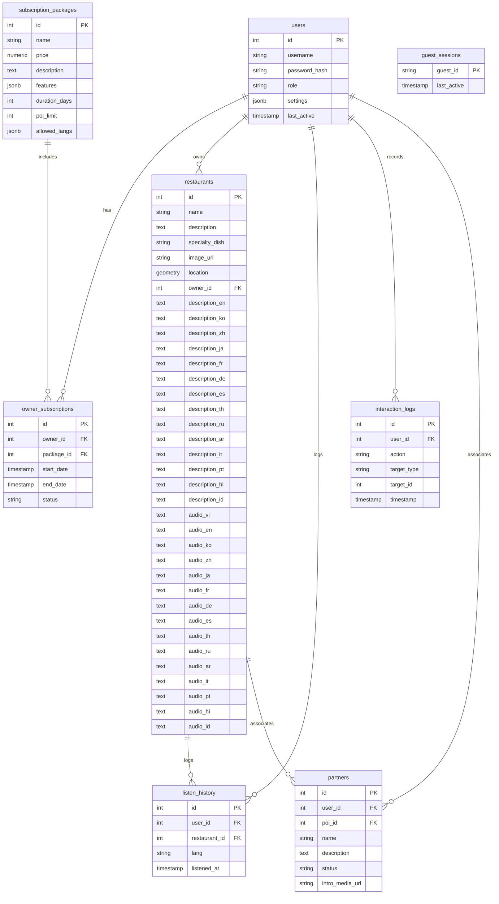

# ERD

```mermaid
erDiagram
    users {
        int id PK
        string username
        string password_hash
        string role
        jsonb settings
        timestamp last_active
    }
    restaurants {
        int id PK
        string name
        text description
        string specialty_dish
        string image_url
        geometry location
        int owner_id FK
        text description_en
        text description_ko
        text description_zh
        text description_ja
        text description_fr
        text description_de
        text description_es
        text description_th
        text description_ru
        text description_ar
        text description_it
        text description_pt
        text description_hi
        text description_id
        text audio_vi
        text audio_en
        text audio_ko
        text audio_zh
        text audio_ja
        text audio_fr
        text audio_de
        text audio_es
        text audio_th
        text audio_ru
        text audio_ar
        text audio_it
        text audio_pt
        text audio_hi
        text audio_id
    }
    subscription_packages {
        int id PK
        string name
        numeric price
        text description
        jsonb features
        int duration_days
        int poi_limit
        jsonb allowed_langs
    }
    owner_subscriptions {
        int id PK
        int owner_id FK
        int package_id FK
        timestamp start_date
        timestamp end_date
        string status
    }
    listen_history {
        int id PK
        int user_id FK
        int restaurant_id FK
        string lang
        timestamp listened_at
    }
    guest_sessions {
        string guest_id PK
        timestamp last_active
    }
    partners {
        int id PK
        int user_id FK
        int poi_id FK
        string name
        text description
        string status
        string intro_media_url
    }
    interaction_logs {
        int id PK
        int user_id FK
        string action
        string target_type
        int target_id
        timestamp timestamp
    }

    users ||--o{ owner_subscriptions : "has"
    subscription_packages ||--o{ owner_subscriptions : "includes"
    users ||--o{ restaurants : "owns"
    users ||--o{ listen_history : "logs"
    restaurants ||--o{ listen_history : "logs"
    users ||--o{ interaction_logs : "records"
    users ||--o{ partners : "associates"
    restaurants ||--o{ partners : "associates"
```
