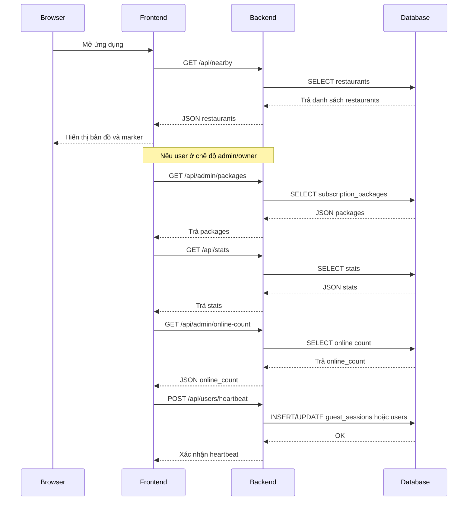
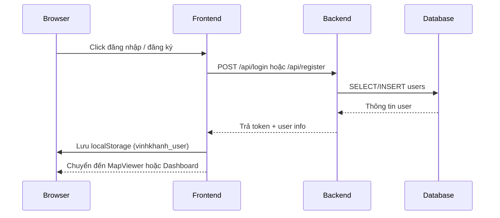
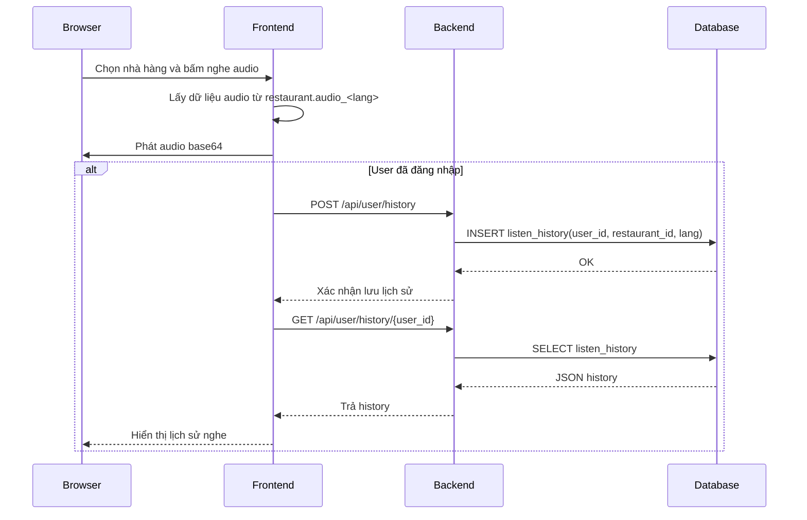
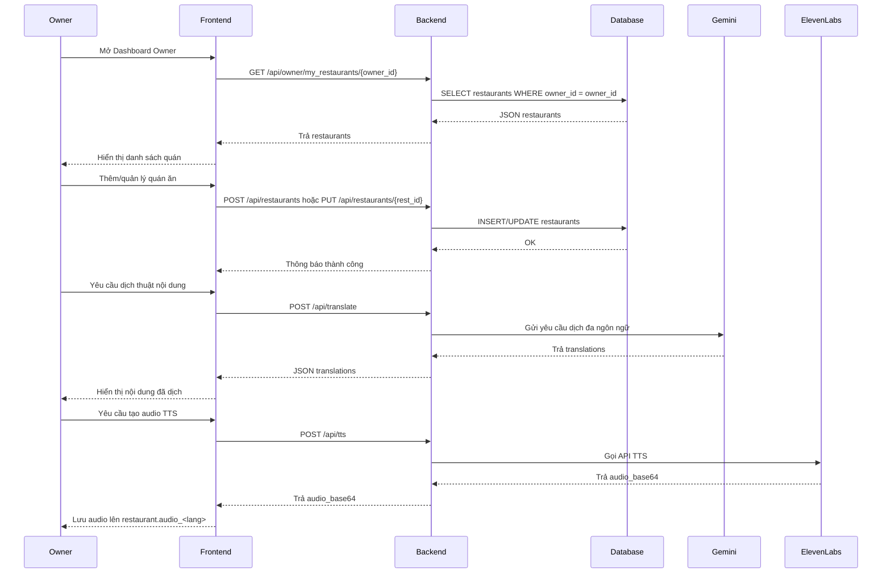
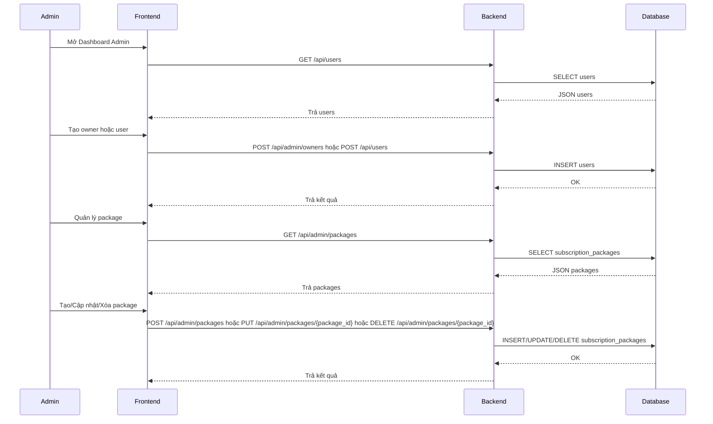

# Sequence Diagrams

## 1. App khởi động và lấy dữ liệu

## 2. User đăng nhập và chuyển sang MapViewer

## 3. Khách/Registered User nghe audio và lưu lịch sử

## 4. Chủ quán quản lý quán và xây dựng nội dung đa ngôn ngữ

## 5. Admin quản lý users, owners và package

