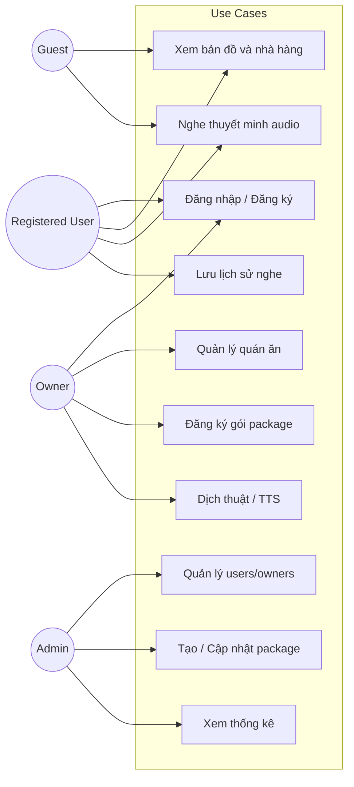

# Use Case Diagram

```mermaid
graph LR
    Admin((Admin))
    Owner((Owner))
    User((Registered User))
    Guest((Guest))

    subgraph "Use Cases"
        Login["Đăng nhập / Đăng ký"]
        Browse["Xem bản đồ và nhà hàng"]
        Audio["Nghe thuyết minh audio"]
        History["Lưu lịch sử nghe"]
        ManagePOI["Quản lý quán ăn"]
        Subscribe["Đăng ký gói package"]
        Translate["Dịch thuật / TTS"]
        ManageUsers["Quản lý users/owners"]
        ManagePackage["Tạo / Cập nhật package"]
        Stats["Xem thống kê"]
    end

    Guest --> Browse
    Guest --> Audio
    User --> Login
    User --> Browse
    User --> Audio
    User --> History
    Owner --> Login
    Owner --> ManagePOI
    Owner --> Subscribe
    Owner --> Translate
    Admin --> ManageUsers
    Admin --> ManagePackage
    Admin --> Stats
```
