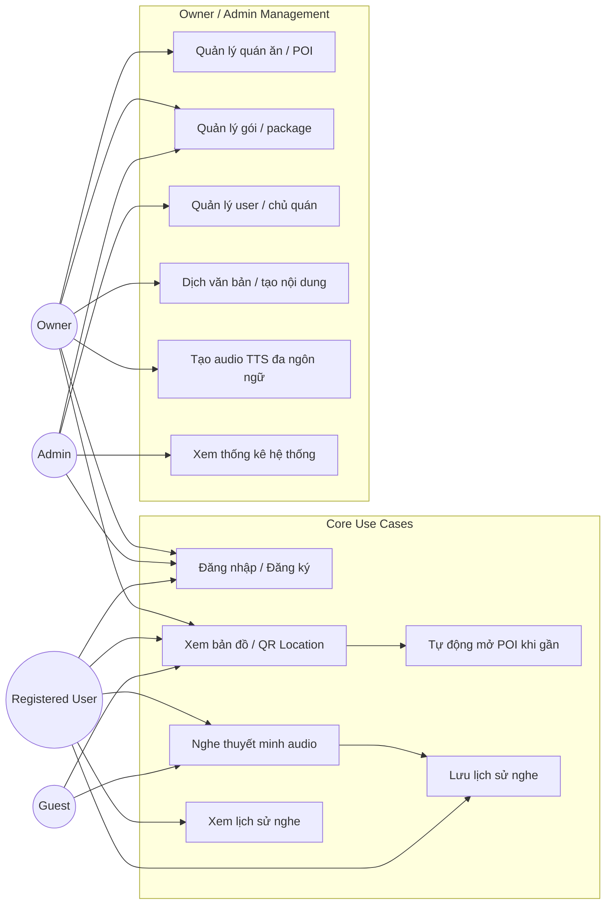

# Use Case Diagram

```mermaid
graph LR
    Guest((Guest))
    User((Registered User))
    Owner((Owner))
    Admin((Admin))

    subgraph "Core Use Cases"
        Auth["Đăng nhập / Đăng ký"]
        BrowseMap["Xem bản đồ / QR Location"]
        PlayAudio["Nghe thuyết minh audio"]
        AutoNearby["Tự động mở POI khi gần"]
        SaveHistory["Lưu lịch sử nghe"]
        ViewHistory["Xem lịch sử nghe"]
    end

    subgraph "Owner / Admin Management"
        ManagePOI["Quản lý quán ăn / POI"]
        ManagePackages["Quản lý gói / package"]
        ManageUsers["Quản lý user / chủ quán"]
        TranslateContent["Dịch văn bản / tạo nội dung"]
        GenerateAudio["Tạo audio TTS đa ngôn ngữ"]
        ViewStats["Xem thống kê hệ thống"]
    end

    Guest --> BrowseMap
    Guest --> PlayAudio
    User --> Auth
    User --> BrowseMap
    User --> PlayAudio
    User --> SaveHistory
    User --> ViewHistory
    Admin --> Auth
    Admin --> ManageUsers
    Admin --> ManagePackages
    Admin --> ViewStats
    Owner --> Auth
    Owner --> ManagePOI
    Owner --> TranslateContent
    Owner --> GenerateAudio
    Owner --> ManagePackages
    Owner --> BrowseMap

    BrowseMap --> AutoNearby
    PlayAudio --> SaveHistory
```
